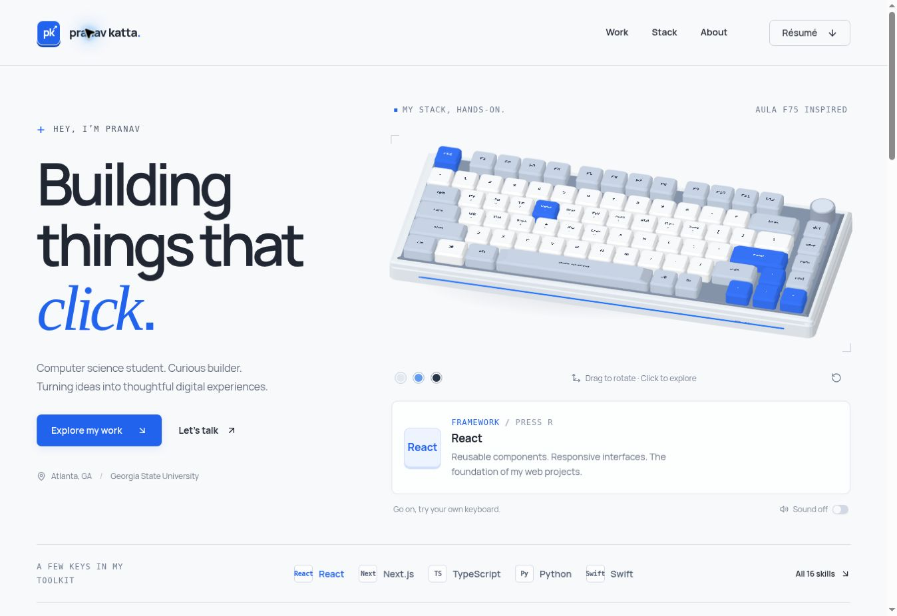

# Pranav Katta — Interactive Portfolio

Your portfolio, ready to upload to GitHub and deploy on Vercel.



## Included

- Interactive AULA F75-inspired 3D keyboard with 80 keys.
- All 16 languages, frameworks, and tools from your resume.
- Clickable keycaps, physical-key input, drag rotation, three keyboard colors, and optional sounds.
- An interactive fallback renderer for browsers without WebGL.
- PantherNav, Bugz, and ContextCard project links.
- Education, certification, contact links, and your original resume PDF.
- Responsive desktop, tablet, and mobile layouts.

Built with Next.js, React, TypeScript, Three.js, Tailwind CSS, and Radix UI.

## 1. Upload to GitHub

1. Unzip `Pranav-Portfolio-GitHub-Vercel.zip`. On your Mac, double-click it.
2. Open the `pranav-portfolio` folder. You should see `package.json`, `app`, `components`, and `public`.
3. Create a GitHub repository, for example `pranav-portfolio`.
4. Choose **Add file → Upload files**. For an empty repository, GitHub may show **uploading an existing file** instead.
5. Drag the contents of the unzipped `pranav-portfolio` folder into the upload area, including its subfolders. Upload the extracted source files, not the ZIP itself.
6. Commit the upload. `package.json` should appear at the top level of the repository, alongside `app`, `components`, and `public`.

If you prefer GitHub Desktop, add the unzipped folder as a local repository and publish it to GitHub. The included `.gitignore` keeps installed dependencies, build output, and local environment files out of commits.

## 2. Deploy on Vercel

1. Open https://vercel.com/new and connect your GitHub account if needed.
2. Import the repository you just created.
3. Use these settings:

| Setting | Value |
| --- | --- |
| Framework Preset | Next.js |
| Root Directory | `./` when `package.json` is at the repository root |
| Install Command | `npm ci` (or Vercel's detected npm default) |
| Build Command | `npm run build` |
| Output Directory | Leave the Next.js default |
| Node.js Version | 22.x |
| Environment Variables | None required |

4. Click **Deploy**. Vercel will give you the live website URL.

If you uploaded the enclosing folder instead of its contents, set Root Directory to `pranav-portfolio`—the folder containing `package.json`.

Future commits to the connected production branch trigger new deployments.

Official instructions: [Next.js on Vercel](https://vercel.com/docs/frameworks/full-stack/nextjs) and [Vercel for GitHub](https://vercel.com/docs/git/vercel-for-github).

## Run locally on your Mac

Use Node.js 22. Open Terminal in the unzipped project folder and run:

```sh
npm install
npm run dev
```

Open http://localhost:3000 in your browser.

To check the production build:

```sh
npm run build
npm start
```

For a separate TypeScript check:

```sh
npm run typecheck
```

## Customize your content

| File | What to edit |
| --- | --- |
| `lib/portfolio-data.ts` | Projects, technologies, skill descriptions, and project links |
| `components/portfolio.tsx` | Name, introduction, education, certification, contact details, and social links |
| `app/globals.css` | Colors, typography, spacing, and responsive layout |
| `components/keyboard.tsx` | Keyboard geometry, key mapping, colors, and interactions |
| `lib/software-renderer.ts` | The fallback 3D renderer |
| `app/layout.tsx` | Browser title and search description |
| `public/Pranav-Katta-Resume.pdf` | Replace this with your updated resume using the same filename |
| `public/favicon.svg` | Browser tab icon |

The email address currently matches your supplied resume: `pranavkatta12344@email.com`. Edit the `email` constant in `components/portfolio.tsx` if you want a different address.

The keyboard is an original model inspired by the AULA F75 layout, not an official product model. The unfinished issue-date placeholder from your certification was omitted from the webpage; the original resume PDF is unchanged.

This export uses ordinary Next.js commands and needs no database or API keys.
